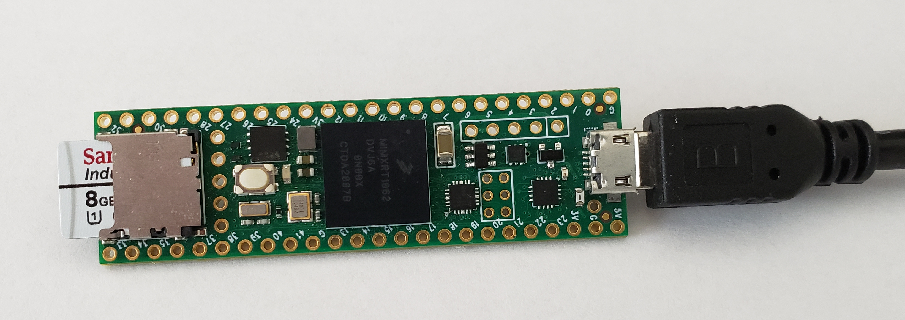

# Teensy Atari Playing Agent

This repository contains the Teensyduino code for running an [AOgmaNeo](https://github.com/ogmacorp/AOgmaNeo) agent on a Teensy 4.1 microcontroller and a host Python script to play Atari Pong.

To use, you need a Teensy 4.1, and a micro-SD card to store agents (and a host PC for running the game environment).

Recording of the agent playing off the Teensy:

Image of the actual microcontroller used:

## Running

Needed libraries for the Python host code:

- [Gym](https://github.com/openai/gym) or [Gymnasium](https://github.com/Farama-Foundation/Gymnasium)
- [TinyScaler](https://github.com/Farama-Foundation/TinyScaler)
- OpenCV for grayscale conversion (allthough this can be replaced with some numpy operations quite easily)
- numpy
- pyserial

Load the Teensyduino code onto the Teensy using the [Teensyduino addon for Arduino](https://www.pjrc.com/teensy/teensyduino.html). Insert a micro-SD card in the FAT32 format with some starting checkpoints for AOgmaNeo (this repository includes a trained checkpoint under the saves/ directory, just copy the files in there onto the SD card.

Power on the Teensy, and wait 4 seconds. Then start the Python script [Pong.py](./Pong.py). The agent should be playing Pong from the Teensy, while continuing to learn further directly on the microcontroller!

## Additional Info

This agent uses [AOgmaNeo](https://github.com/ogmacorp/AOgmaNeo), a biologically-inspired "Non-Deep Learning" online/incremental machine learning system. Unlike Deep Learning, it does not rely on the backpropagation algorithm, or dense differentiable representations, or i.i.d. sampling.

The version of AOgmaNeo included in this repository has been modified slightly for compatibility. It is also based on the branch `ultralightf_faster3_multisom` from the AOgmaNeo repository.

The SPH (Sparse Predictive Hierarchy) used here is only a single layer, unlike most applications of AOgmaNeo. More were not necessary. There is however still the ImageEncoder, which converts the input observation image to a CSDR (Columnar Sparse Distributed Representation), so overall there are 2 layers in the system needed.
